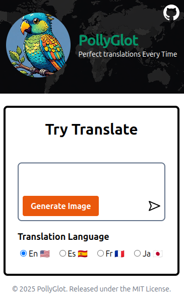

# Translation App

A multilingual translation & AI image generation chat app (for learning purposes).
This project is based on [Scrimba](https://scrimba.com/) solo project.

## Demo

[](https://translation-app-ochre.vercel.app/)

## Screen Shot



## Common Pitfalls

- Trying to implement everything server-side with hidden APIs from the start was overwhelming—there was too much to remember, and even asking AI didn't help me retain it. It was also hard to output and validate like a browser on the server side.
- After struggling for 2-3 days, I realized it wasn't working. So I used Vite to enable API key usage on the browser side for easier validation and built that first. Then I instructed Copilot to make it serverless. That made the code much easier to validate too.
- I initially tried using Node.js, but I'd learned it previously on FreeCodeCamp and barely remembered anything. It made code reviews too burdensome, so I abandoned it. Vercel Serverless required less learning and fit the current situation better.
- Since Vercel serverless is stateless, attempting to implement rate limiting by defining variables in the api folder's JS files doesn't work—the count variables get reinitialized on every request. I solved this by using Upstash's library to store and update count variables in an external database.

## Tips

- OpenAI's image generation API often produces subpar results when given non-English input, so I translated it into English before using it for image generation.

## How this project was built

Initially, with AI(copilot) tab proposal assistance, I drafted the CSS and HTML.
Afterward, I completed this project through AI-driven development: asking questions, implementing instructions, bug checking, and code critique.
If I don't understand code suggested or generated by AI, ask the AI to explain it, and only adopt it once I'm personally satisfied with the explanation.
Every line was **reviewed, tested, and either kept with confidence or rewritten/deleted by me**  
 → The final code contains only what I'm confident in and take responsibility for

## Overview

- Translate input text into multiple languages (English, Spanish, French, Japanese) using AI
- AI-powered image generation feature
- Chat-style history display and editing
- Error handling included

## Tech Stack

- Frontend: HTML, Vanilla JS, Tailwind CSS
- Backend API: OpenAI API (accessed via /api/openai, API key managed server-side)

## Main Features

- Text translation (using OpenAI API)
- AI image generation
- Chat history display
- Language switching (EN/ES/FR/JA)
- Error message display

## Security

- API key is hidden on the server side and never exposed to the client

## Setup & Usage

**Security note**

- Make sure your .env.local file (containing your API key) is listed in .gitignore and never committed to your repository.

### Setup with Vercel + OpenAI API

1. **Clone the repository**

   ```sh
   git clone <repository-url>
   cd translation-app
   ```

2. **Install dependencies**

   ```sh
   npm install
   npm install openai
   ```

3. **Prepare your OpenAI API key**

   - Get your API key from [OpenAI](https://platform.openai.com/)
   - Create a `.env.local` file and add:
     ```
     OPENAI_API_KEY=sk-XXXXXXXXXXXXXXXXXXXXXXXXXXXX
     ```

4. **Deploy to Vercel**

   - Create a [Vercel](https://vercel.com/) account and import your project
   - Set the `OPENAI_API_KEY` environment variable in Project Settings > Environment Variables
   - Deploy: the serverless API (`/api/openai`) will be enabled automatically

5. **Local development (optional)**
   ```sh
   npx vercel dev
   ```
   or
   ```sh
   npm run dev
   ```
   to start the local server

---

### Using OpenAI API Directly from the Frontend with Vite (for learning/testing only)

1. **Install dependencies**

   ```sh
   npm install
   npm install vite
   ```

2. **Add your OpenAI API key to .env.local**

   ```
   VITE_OPENAI_API_KEY=sk-XXXXXXXXXXXXXXXXXXXXXXXXXXXX
   ```

3. **Call the API directly from the frontend**

   - Example: `import { OpenAI } from "openai";
const openai = new OpenAI({
  dangerouslyAllowBrowser: true,
  apiKey: import.meta.env.VITE_OPENAI_API_KEY
});`
   - Implement API requests directly in `index.js`, etc.

4. **Start the Vite dev server**
   ```sh
   npx vite
   ```
   or
   ```sh
   npm run dev
   ```


**⚠️ CRITICAL SECURITY WARNING**
- **Never commit this code to a public repository.** Even if `.env` files are in `.gitignore`, Vite bundles `VITE_` prefixed environment variables directly into the client-side JavaScript during build time.
- **The API key will be visible** in the built JavaScript files. Anyone can:
  - View the source code in the browser's developer tools
  - Inspect the bundled JavaScript files
  - Extract your API key from the deployed application
- **This method exposes your API key to the frontend. Never use it in production.**
- **For learning/testing/personal use only.**
- If you must use this approach, ensure your repository is **private** and never deploy to a public hosting service.
- This method exposes your API key to the frontend. **Never use it in production.**
- For learning/testing/personal use only.


---

## License

Made with ❤️ by [@shotaro-dev](https://github.com/shotaro-dev) • [MIT Licensed](LICENSE)

## Acknowledgments

- [Scrimba](https://scrimba.com/) for the original project idea and learning platform
- [OpenAI](https://platform.openai.com/) for providing the AI API
- Images generated by Grok
